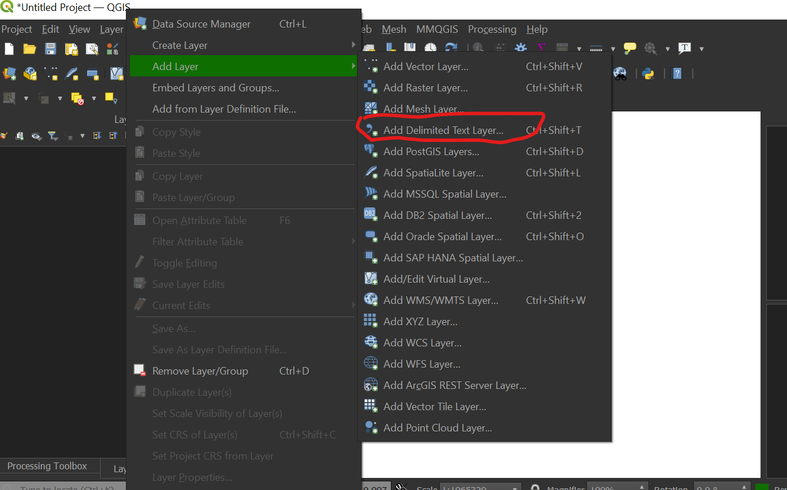
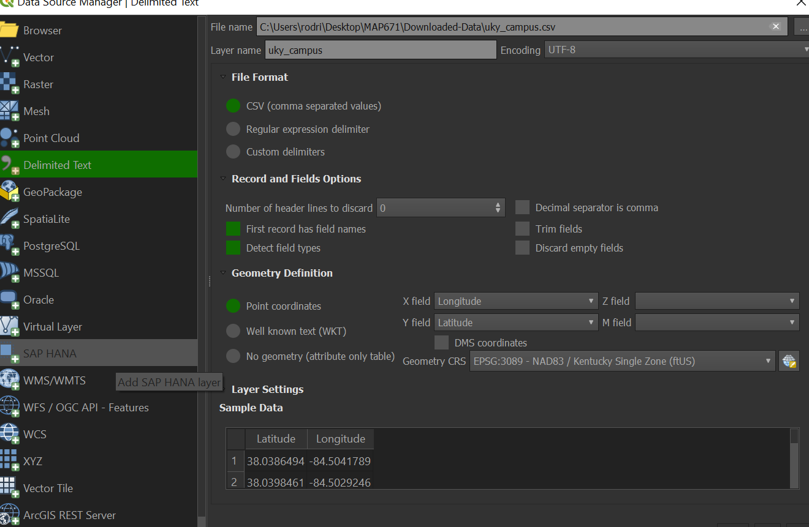
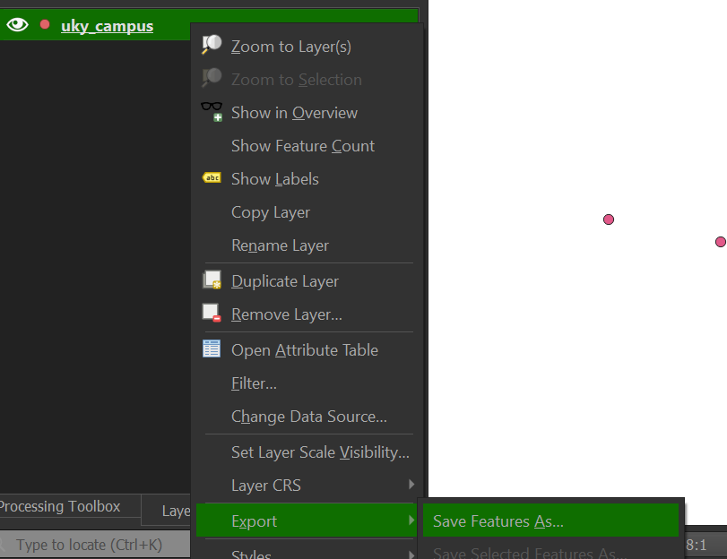
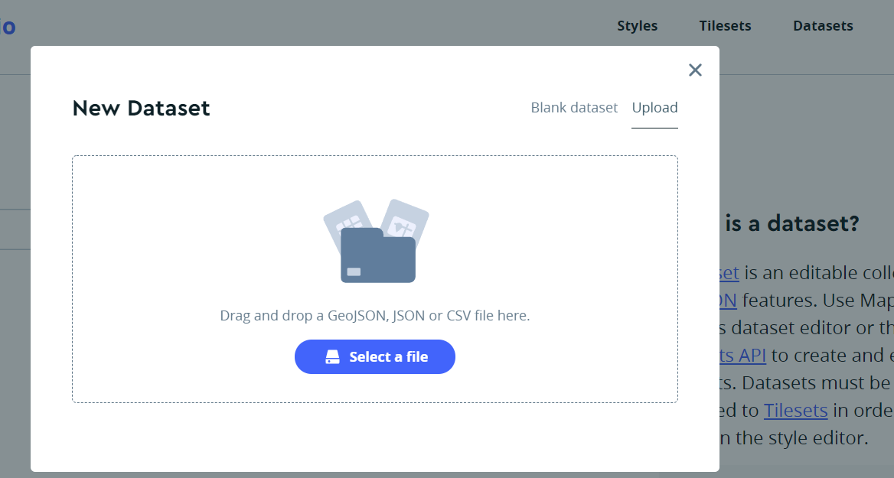
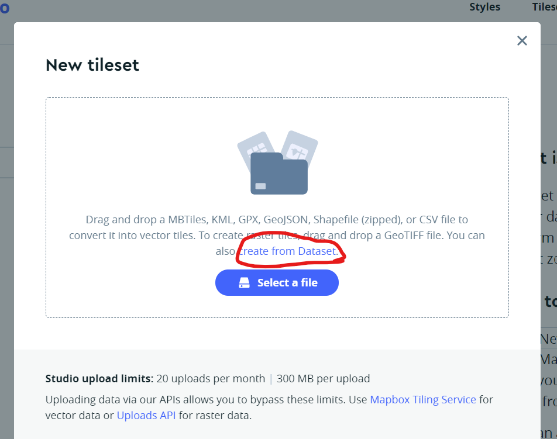

# University of Kentucky Campus

## Step 1: Data Collection

To begin the map-making process, I used GPS features within GoogleMaps to collect coordinate points of 6 Univerisity of Kentucky buildings (Lafferty hall, Appalachian Center, Patterson Office Tower, Erickson Hall, William T. Young Library, and the Gatton Student Center) with my iPhone XS. Being an anthropology graduate student as well, I wanted to see how accurate collected geographical coordinates from my phone would be to see if it would be reliable when conducting an excavation this summer. I chose these 6 buildings due to how much time I have spent in them this semester.

## Step 2: Input Into QGIS

After collecting the coordinate points, I input the latitudes as well as longitudes in Excel and then uploaded the file into QGIS. First, I hovered over the layer option within QGIS, clicked on "Add Layer," and then proceeded to click on "Add Delimited Text Layer."

*Adding a Layer in QGIS*

From there, I set the CRS to EPSG: 3089 - NAD83/Kentucky Single Zone (ftUS) to make sure that the coordinate points matched up as closely as possible. I also set the file format as a CSV and made sure to define the geometry in terms of point coordinates.

*Defining CRS & Coordinates*

## Step 3: Convert to GeoJSON

Next, I saved the layer as a GeoJSON, by clicking on the layer, clicking on "Export," and then clicking on "Save Features As..." to do so.

*Saving as a GeoJSON*

## Step 4: Create New Dataset on Mapbox Studio

After saving the layer as a GeoJSON, I proceeded to create a new dataset on Mapbox Studio but first deleted the line defining the CRS through Visual Studio Code. 

*Creating a Dataset*

## Step 5: Create New Tileset on Mapbox Studio

Once the dataet was created, I then created a new tileset by utilizing the now made dataset so that I could input the tileset on a new style.

*Creating a Tileset*

## Step 6: Create Map

With the tileset put into place, I used Mapbox Studio to create a map utilizing a basic style in order to style the map and use 3D buildings as well. For the datapoints, I utilized a paw svg and saw that they lined up perfectly with the features. I am now more confident in my ability to collect coordinate points and plot them onto a map. 
